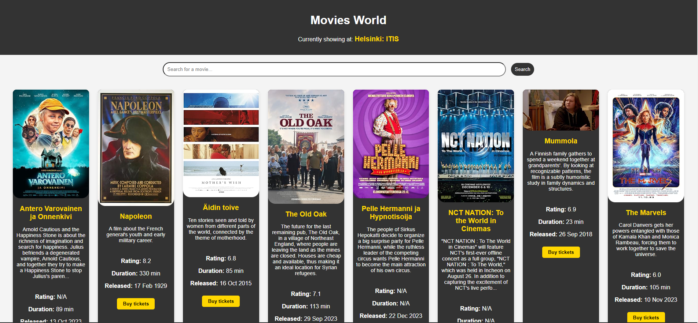

# Movies World Web App

Welcome to the *Movies World* web app, a vibrant web app built using the classic trio of web development: plain JavaScript, HTML, and CSS. This project is a testament to the power of these core technologies, as no additional libraries are used.

This project is to complete the Project 2 at Laurea University of Applied Sciences' Javascript course

## Deployment

The app is deployed on Azure Static Web Apps, and it can be accessed live via the following link:

[https://victorious-mud-0ca3b1803.4.azurestaticapps.net](https://victorious-mud-0ca3b1803.4.azurestaticapps.net)

## Project Structure

The project consists of the following main components:

- `index.html`: The landing page where users can choose a theater.
- `movies.html`: A page that displays movies from the selected theater.
- `styles/`: This directory contains the CSS files for styling the application.
  - `main.css`: Styles common to the entire application.
  - `movies.css`: Specific styles for the movie display page.
- `scripts/`: This directory houses the JavaScript files that handle dynamic behavior.
  - `main.js`: Handles fetching and displaying theater data.
  - `movies.js`: Manages movie data retrieval and presentation based on the selected theater.

## Features

- **Theater Selection**: Users can select from a list of theaters to see what's currently playing.
- **Movies Display**: A grid layout presents movies with options to see more details.
- **Search Functionality**: Both theaters and movies can be searched through a responsive search bar.
- **Dynamic Content**: Movie and theater information is fetched in real-time from the Finnkino API & OMDB.

## Feature Images

```markdown


